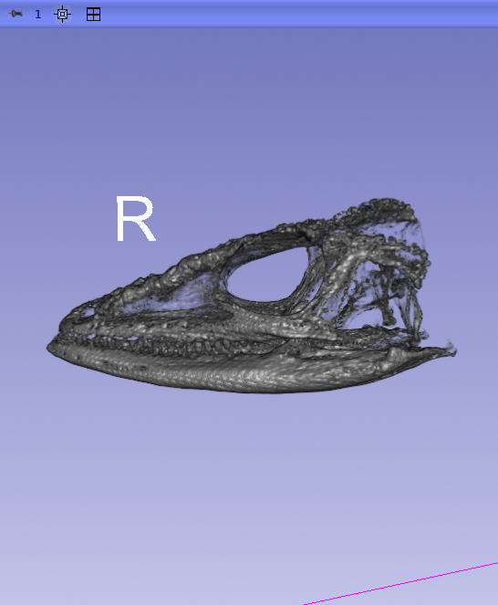

## MorphoDepot Repository
Repository for segmentation of a specimen scan.  See [this JSON file](MorphoDepotAccession.json) for specimen details.
* Species: Anolis equestris
* Modality: Micro CT (or synchrotron)
* Contrast: No
* Dimensions: (164, 132, 301)
* Spacing (mm): (0.2, 0.2, 0.2)

## Screenshots

